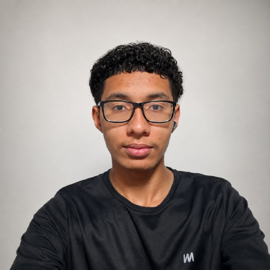
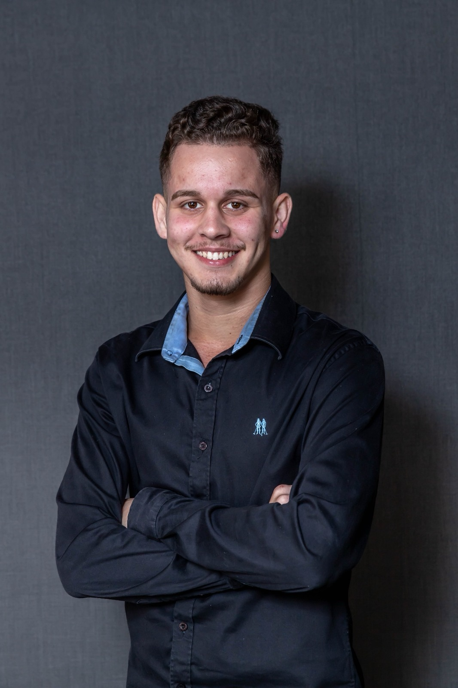
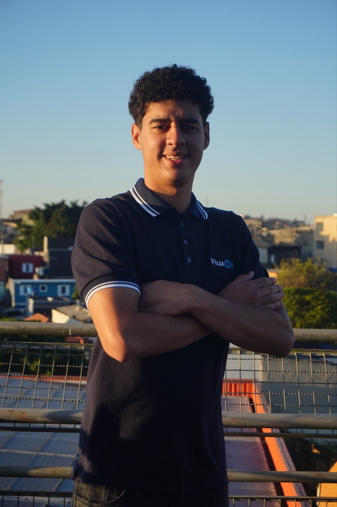
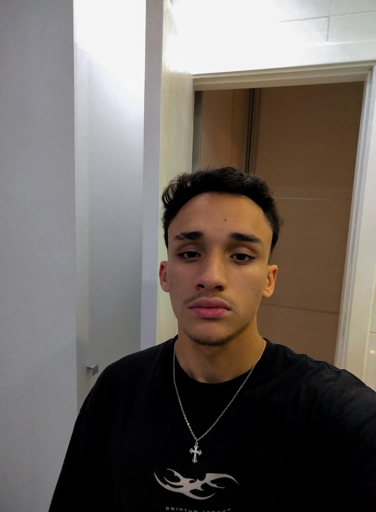

# TECHNOS — Doneit

**Challenge FIAP 2026 | Turma do Bem**

## 1. Sobre o projeto

A nossa solução é uma plataforma desenvolvida pela equipe TECHNOS com o objetivo de apoiar a Turma do Bem na gestão e no incentivo às doações.

A proposta busca facilitar a jornada dos doadores, melhorar a organização das informações e contribuir para uma gestão mais eficiente das contribuições recebidas.

Por meio de uma interface intuitiva, o projeto apresenta recursos voltados à divulgação da iniciativa, à apresentação dos itens de doação e ao incentivo à participação de pessoas e empresas.

### Objetivos do projeto

- Facilitar o processo de doação.
- Incentivar a participação de novos doadores.
- Melhorar a experiência dos usuários na plataforma.
- Contribuir para a organização e a gestão das doações.
- Apoiar o trabalho social realizado pela Turma do Bem.

## 2. Tecnologias utilizadas

As tecnologias utilizadas no desenvolvimento do projeto incluem:

- **HTML5:** estruturação das páginas.
- **CSS3:** estilização, layout e responsividade.
- **Git:** controle de versão do código.
- **GitHub:** armazenamento e compartilhamento do repositório.

## 3. Estrutura de pastas

```text
Doneit/
│
├── index.html
│
├── css/
│   ├── style.css
│   ├── sobre.css
│   ├── doar.css
│   ├── faq.css
│   ├── contato.css
│   ├── integrantes.css
|   ├── doadores.css
|   ├── edital.css
|   └── empresas.css
│    
├── imagens/
│   └── logos e ícones
│
├── images/
│   ├── itensdoacao/
|   ├── projeto/
│   └── formas-pagamento/
│
├── paginas/
│   ├── sobre.html
│   ├── faq.html
│   ├── contato.html
│   └── integrantes.html
│
│   └── solucao/
│       └── doar.html
|       ├── doadores.html
|       ├── edital.html
|       └── empresas.html
│
└── README.md
```

*A estrutura acima é uma referência baseada nas páginas e nos caminhos apresentados durante o desenvolvimento. Ajuste os nomes para corresponder exatamente às pastas do repositório.*

## 4. Autores e integrantes

Equipe **Doneit — FIAP Challenge 2026**.

### Gustavo Souza Lopes

- **RM:** 575057
- **Turma:** 1 TDSPT
- **LinkedIn:** [https://www.linkedin.com/in/gustavo-souza-lopes]
- **GitHub:** [https://github.com/GustaLopess]
 

### Kaique Ferreira Castro

- **RM:** 575222
- **Turma:** 1 TDSPT
- **LinkedIn:** [https://www.linkedin.com/in/kaiquefcastro]
- **GitHub:** [https://github.com/kaiqueznx7]
 

### Lucas Alves Pires

- **RM:** 576621
- **Turma:** 1 TDSPT
- **LinkedIn:** [https://www.linkedin.com/in/lucaspires31]
- **GitHub:** [https://github.com/lucaspires31]
 

### Rafael Girardi Ramos

- **RM:** 575391
- **Turma:*1 TDSPT
- **LinkedIn:** [https://www.linkedin.com/in/rafael-ramos-99a3b343b]
- **GitHub:** [https://github.com/Rafaelreifsss]
 

### Daniel Platero de Souza

- **RM:** 575084
- **Turma:** 1 TDSPT
- **LinkedIn:** [https://www.linkedin.com/in/daniel-rodrigues-406927414]
- **GitHub:** [https://github.com/Platero1310]
 

## 5. Imagens e demonstração

Capturas de tela das principais páginas para demonstrar o funcionamento e a identidade visual do sistema.

### Página inicial


### Página de doação


### Página sobre o projeto


## 6. Repositório do GitHub

O código-fonte do projeto está disponível no repositório:

**GitHub:** [(https://github.com/TechnosDevelopers/front-end-challenge)]
## 7. Contato

Para dúvidas, sugestões ou informações sobre o projeto, entre em contato com os integrantes da equipe pelos respectivos perfis do LinkedIn ou GitHub.

**Equipe:** TECHNOS  
**Projeto:** Doneit
**Instituição:** FIAP  
**Desafio:** Challenge 2026 — Turma do Bem

---

Desenvolvido pela equipe TECHNOS como parte do Challenge FIAP 2026.
